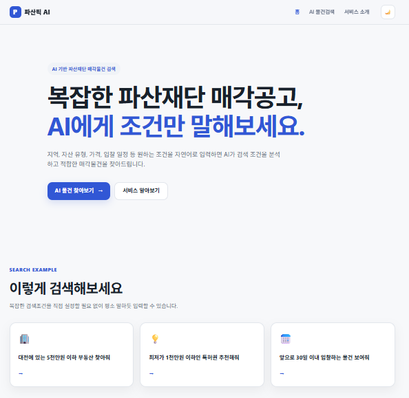
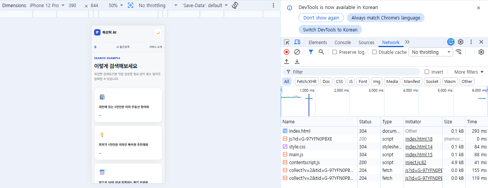
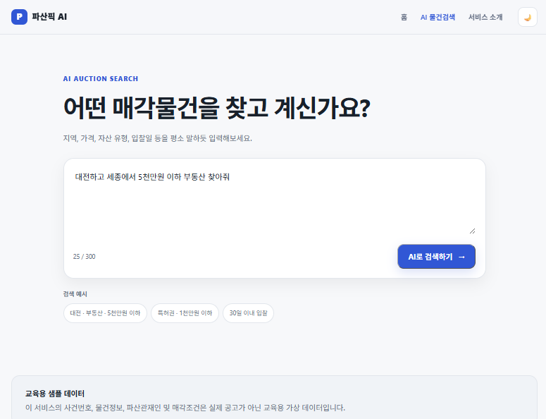
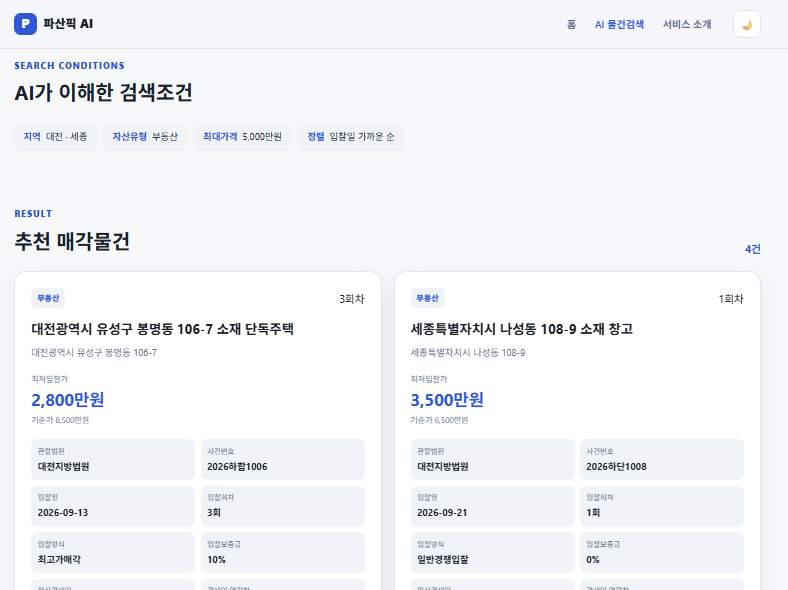
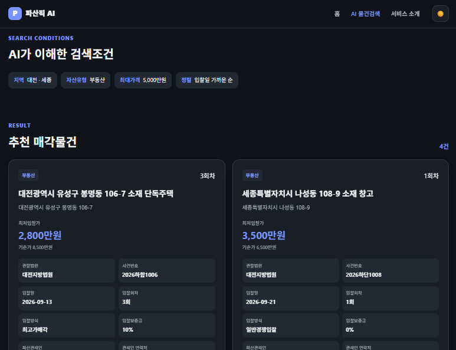
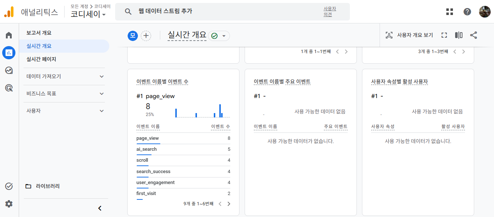
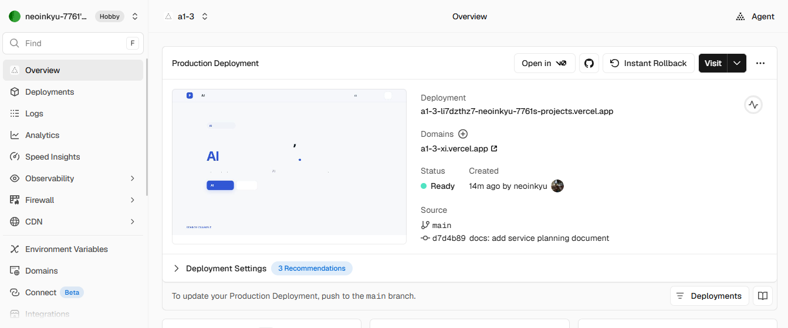

# 파산픽 AI

> 자연어로 원하는 조건을 입력하면 AI가 파산재단 매각물건을 검색해주는 웹 서비스

**A1-3 | AI 웹 개발: 내 아이디어를 현실로, AI 웹 서비스 빌딩**

---

## 1. 서비스 소개

**파산픽 AI**는 사용자가 원하는 파산재단 매각물건의 조건을 자연어로 입력하면, Google Gemini가 검색 의도를 분석하여 구조화된 검색조건으로 변환하고 Python 프로그램이 샘플 데이터베이스에서 조건에 맞는 물건을 찾아주는 AI 웹 서비스입니다.

예를 들어 다음과 같이 검색할 수 있습니다.

> 대전하고 세종에서 5천만원 이하 부동산 찾아줘.

> 천만원 안쪽으로 살 수 있는 특허 물건 있어?

> 차량 중에서 제일 싼 것부터 보여줘.

AI가 실제 매각물건을 임의로 생성하는 것이 아니라 **사용자의 검색 의도를 분석하는 역할**을 담당하고, 실제 검색은 Python이 JSON 데이터베이스를 대상으로 수행하도록 구현했습니다.

---

## 2. 배포 URL

### Web Service

**Vercel**

https://a1-3-xi.vercel.app

### GitHub Repository

`A1-3`

> GitHub 저장소 URL은 제출 시 해당 Repository 주소를 기재합니다.

---

## 3. 주요 기능

### 자연어 기반 AI 검색

사용자가 일반적인 문장으로 원하는 매각물건의 조건을 입력할 수 있습니다.

예:

```text
대전하고 세종 쪽에서 5천만원 넘지 않는 부동산 좀 찾아줘.
입찰일 빠른 순으로 보여줘.
```

Gemini가 검색조건을 다음과 같이 구조화합니다.

```json
{
  "regions": [
    "대전",
    "세종"
  ],
  "category": "부동산",
  "subcategory": null,
  "max_price": 50000000,
  "min_price": null,
  "bid_within_days": null,
  "sort": "bid_date"
}
```

이후 Python이 해당 조건으로 샘플 데이터베이스를 검색합니다.

---

### 다양한 매각자산 검색

현재 샘플 데이터는 총 100건으로 구성되어 있습니다.

| 자산 유형  |      건수 |
| ------ | ------: |
| 부동산    |      40 |
| 채권     |      15 |
| 지식재산권  |      15 |
| 주식     |      10 |
| 자동차    |       8 |
| 기계기구   |       8 |
| 동산     |       4 |
| **합계** | **100** |

---

### 검색 결과 제공

검색 결과 카드에서 다음 정보를 확인할 수 있습니다.

* 자산 유형
* 물건명
* 소재지
* 기준가
* 최저입찰가
* 관할법원
* 사건번호
* 입찰일
* 입찰회차
* 입찰방식
* 입찰보증금
* 파산관재인
* 파산관재인 연락처
* 추천 이유

---

### 반응형 웹

PC와 모바일 화면에서 모두 정상적으로 사용할 수 있도록 반응형으로 구현했습니다.

* 데스크톱 다열 카드
* 모바일 1열 카드
* 모바일 메뉴 최적화
* 검색창 및 버튼 크기 조정
* 가로 스크롤 방지

---

## 4. 페이지 구성

서비스는 총 3개의 주요 페이지로 구성됩니다.

### Home

`index.html`

* 서비스 소개
* 검색 시작 버튼
* 추천 검색 예시
* AI 검색 작동방식
* 교육용 데이터 안내

### AI 물건검색

`search.html`

* 자연어 입력
* 추천 검색어
* AI 검색
* 검색조건 표시
* 검색 결과 카드
* 오류 및 지연 안내

### 서비스 소개

`about.html`

* 서비스 개발 목적
* AI 작동방식
* 데이터 구성
* 기술 스택
* 이용 안내 및 주의사항

---

## 5. AI 검색 처리 구조

전체 처리 흐름은 다음과 같습니다.

```text
사용자 자연어 입력
        ↓
JavaScript
        ↓
fetch('/api/search')
        ↓
Vercel Serverless Function
        ↓
Python
        ↓
Gemini API
        ↓
자연어 → 검색조건 JSON
        ↓
Python DB 검색
        ↓
data/auctions.json
        ↓
검색 결과 JSON 반환
        ↓
JavaScript
        ↓
웹 화면에 결과 표시
```

AI와 프로그램의 역할을 분리했습니다.

```text
Gemini
= 사용자의 자연어 검색 의도 이해

Python
= 실제 데이터 검색 및 정렬
```

이를 통해 AI가 존재하지 않는 매각물건을 생성하지 않고, 데이터베이스에 존재하는 물건만 결과로 반환하도록 구성했습니다.

---

## 6. 기술 스택

### Frontend

* HTML5
* CSS3
* Vanilla JavaScript

### Backend

* Python
* Vercel Serverless Functions

### AI

* Google Gemini API
* `gemini-3.1-flash-lite`

### Data

* JSON
* 교육용 샘플 데이터 100건

### Deployment

* Git
* GitHub
* Vercel

### Analytics

* Google Analytics 4

---

## 7. 프로젝트 구조

```text
A1-3/
│
├─ api/
│  └─ search.py
│
├─ css/
│  └─ style.css
│
├─ data/
│  └─ auctions.json
│
├─ docs/
│  ├─ 서비스기획서.md
│  └─ screenshots/
│
├─ images/
│
├─ js/
│  └─ main.js
│
├─ index.html
├─ search.html
├─ about.html
│
├─ requirements.txt
├─ vercel.json
├─ README.md
└─ .gitignore
```

---

## 8. AI 기능 입력·출력

### 입력

사용자가 검색하고 싶은 조건을 자연어로 입력합니다.

예:

```text
천만원 안쪽으로 살 수 있는 특허 물건 있어?
```

### AI 분석

Gemini가 검색조건을 구조화합니다.

```text
자산유형: 지식재산권
세부유형: 특허권
최대가격: 1,000만원
```

### 출력

조건에 맞는 샘플 매각물건을 검색해 카드 형태로 출력합니다.

---

## 9. 실패 처리

### 빈 입력

API를 호출하지 않고 다음 메시지를 표시합니다.

```text
검색 조건을 입력해주세요.
```

### AI 또는 API 오류

```text
AI 검색 중 오류가 발생했습니다.
잠시 후 다시 시도해주세요.
```

### 응답 지연

JavaScript `AbortController`를 이용해 30초 이상 응답이 없는 요청을 중단합니다.

```text
응답이 지연되고 있습니다.
잠시 후 다시 시도해주세요.
```

### 검색 결과 없음

```text
조건에 맞는 매각물건을 찾지 못했습니다.
지역이나 가격 조건을 넓혀서 다시 검색해보세요.
```

---

## 10. 환경 변수 설정

Gemini API Key는 코드에 직접 저장하지 않습니다.

사용하는 환경변수:

```text
GEMINI_API_KEY
```

### 로컬 개발

로컬에서는 다음과 같은 형태의 환경설정을 사용할 수 있습니다.

```text
GEMINI_API_KEY=본인의_Gemini_API_Key
```

환경변수가 포함된 파일은 GitHub에 업로드하지 않습니다.

`.gitignore`

```gitignore
.env
.env.*
.vercel
__pycache__/
*.pyc
.venv/
```

### Vercel

Vercel 프로젝트에서 다음 경로로 환경변수를 등록합니다.

```text
Project
→ Settings
→ Environment Variables
→ GEMINI_API_KEY
```

Development, Preview, Production 환경에 적용합니다.

---

## 11. 로컬 실행 방법

### 1. Repository Clone

```bash
git clone <A1-3 Repository URL>
```

```bash
cd A1-3
```

### 2. Vercel CLI 설치

```bash
npm install -g vercel
```

### 3. Vercel 프로젝트 연결

```bash
vercel link
```

### 4. Development 환경설정 가져오기

```bash
vercel pull
```

### 5. 로컬 서버 실행

```bash
vercel dev
```

기본 실행 주소 예:

```text
http://localhost:3000
```

### 6. API 상태 확인

```text
http://localhost:3000/api/search
```

정상 예:

```json
{
  "status": "ok",
  "message": "A1-3 search API is running.",
  "gemini_key_configured": true,
  "gemini_model": "gemini-3.1-flash-lite"
}
```

---

## 12. 배포 방법

GitHub의 `main` 브랜치와 Vercel 프로젝트를 연결했습니다.

따라서 다음 흐름으로 자동 배포됩니다.

```text
VS Code
↓
git commit
↓
git push
↓
GitHub main
↓
Vercel 자동 Build
↓
Production 배포
```

코드 수정 후:

```bash
git add .
```

```bash
git commit -m "커밋 메시지"
```

```bash
git push
```

를 실행하면 Vercel에서 새로운 배포가 생성됩니다.

---

## 13. 보너스 과제

### 다크 모드

라이트 모드와 다크 모드 전환 기능을 구현했습니다.

사용자의 설정은 브라우저 `localStorage`에 저장되어 다른 페이지로 이동하거나 새로고침해도 유지됩니다.

---

### 마이크로 인터랙션

다음 UI 인터랙션을 구현했습니다.

* 버튼 Hover
* 버튼 클릭 효과
* 입력창 Focus
* 카드 Hover
* AI 검색 로딩 애니메이션
* 검색 결과 Fade-in
* 검색 결과 영역 Smooth Scroll

---

### Google Analytics 4

GA4를 연동하여 방문자 및 AI 기능 이용현황을 측정합니다.

기본 이벤트:

```text
page_view
first_visit
scroll
```

AI 기능 커스텀 이벤트:

```text
ai_search
search_success
search_no_result
search_error
```

예를 들어 실제 테스트 과정에서 GA4 Realtime 보고서를 통해 `ai_search`와 `search_success` 이벤트가 정상적으로 수집되는 것을 확인했습니다.

사용자가 검색창에 입력한 자연어 문장 자체는 Analytics로 전송하지 않습니다.

---

## 14. 주요 개발 및 오류 해결 과정

### PowerShell npm 실행 제한

Node.js 설치 후 PowerShell의 Execution Policy로 인해 `npm.ps1` 실행이 차단되었습니다.

현재 사용자 범위의 실행정책을 조정하여 해결했습니다.

---

### Vercel Python Runtime의 `uv` 문제

`vercel dev` 실행 시 다음 오류가 발생했습니다.

```text
uv is required for this project but failed to install
```

Windows에 `uv`를 직접 설치하고 PATH를 설정하여 해결했습니다.

---

### Python Function 502 오류

초기 실행 과정에서 다음 오류가 발생했습니다.

```text
502 BAD_GATEWAY
NO_RESPONSE_FROM_FUNCTION
```

`/api/search`의 GET 테스트와 POST 테스트를 분리하여 Python Function 자체와 Gemini 호출 문제를 단계적으로 확인했습니다.

---

### Vercel 환경변수 미전달

API 상태 확인 결과:

```json
"gemini_key_configured": false
```

가 확인되었습니다.

Gemini API Key 자체는 정상적으로 동작했지만 Vercel Function에 환경변수가 전달되지 않은 문제였습니다.

Vercel Project의 Environment Variables에 `GEMINI_API_KEY`를 등록하고 Development 환경을 연결한 결과:

```json
"gemini_key_configured": true
```

로 변경되어 문제를 해결했습니다.

---

### Gemini API 단독 테스트

Gemini API와 Structured Output을 각각 별도로 테스트하여 다음 항목이 정상임을 확인했습니다.

* Gemini API Key
* `google-genai`
* `gemini-3.1-flash-lite`
* Structured JSON Output
* 자연어 검색조건 분석

이를 통해 프론트엔드, 백엔드, 데이터베이스, AI API의 문제를 단계별로 분리하여 해결했습니다.

---

## 15. 데이터 안내

현재 서비스에는 **교육 목적으로 생성한 가상의 파산재단 매각물건 100건**이 사용됩니다.

다음 정보는 모두 실제 정보가 아닙니다.

* 사건번호
* 채무자명
* 파산관재인
* 전화번호
* 주소
* 매각가격
* 입찰일
* 기타 매각조건

실제 법원·파산재단 매각공고와 관련이 없습니다.

---

## 16. 향후 확장 방향

실제 서비스로 발전시키는 경우 다음 구조로 확장할 수 있습니다.

```text
대법원 파산재단 매각공고
        ↓
게시글 및 PDF 수집
        ↓
AI 문서 분석
        ↓
공고문 속성 자동 추출
        ↓
DB 저장
        ↓
자연어 검색
        ↓
물건 비교 및 추천
```

공고문에서 구조화할 수 있는 주요 정보:

* 관할법원
* 파산사건번호
* 파산관재인
* 관재인 연락처
* 관재인 주소
* 자산 유형
* 소재지
* 감정가 및 기준가
* 최저입찰가격
* 입찰기일
* 입찰회차
* 입찰방법
* 입찰보증금
* 부동산 상세정보
* 채권 상세정보
* 지식재산권 등록정보
* 자동차 및 기계기구 상세정보

---

## 17. 서비스 화면

### 데스크톱



### 모바일



### AI 검색





### 다크 모드



### Google Analytics



### Vercel 배포



---

## 18. AI 코딩 도구 활용

서비스 기획부터 코드 작성, 오류 분석 및 수정 과정에서 AI 코딩 도구를 활용했습니다.

주요 활용 분야:

* 서비스 아이디어 구체화
* 프로젝트 구조 설계
* HTML/CSS/JavaScript 작성
* Python Serverless Function 작성
* Gemini API 연동
* JSON 데이터 구조 설계
* 오류 원인 분석
* Vercel 배포 문제 해결
* GA4 이벤트 설계
* 문서화

단순히 생성된 코드를 사용하는 데 그치지 않고 실행 과정에서 발생한 오류를 확인하고, 원인을 단계적으로 분리하여 수정했습니다.

---

## 19. 서비스 기획서

상세 서비스 기획은 다음 문서에 정리했습니다.

[서비스 기획서](docs/서비스기획서.md)

---

## 20. 주의사항

본 프로젝트는 **AI 웹 개발 교육과제 수행을 위한 서비스**입니다.

현재 표시되는 파산재단 매각물건은 실제 공고가 아닌 교육용 가상 데이터입니다.

실제 서비스로 확장할 경우 반드시 법원 또는 파산관재인이 제공하는 최신 원문 공고를 다시 확인하는 절차가 필요합니다.

AI 검색 결과만을 근거로 투자 또는 법률적 판단을 해서는 안 됩니다.

---